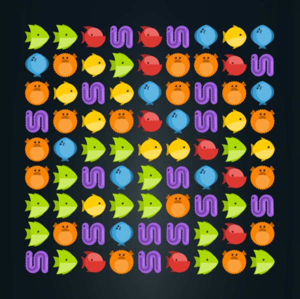

# Linker sample game

Welcome to the linker sample game. Click and drag and link three or more fish of the same color together to remove them from the board. Long chains of fish yields boosters.

[Play the game!](defold://project.build)

Check out [the documentation pages](https://defold.com/learn) for more examples, tutorials, manuals and API docs.

If you run into trouble, help is available in [our forum](https://forum.defold.com).

Happy Defolding!

----

This project is released under the Creative Commons CC0 1.0 Universal license.

You’re free to use these assets in any project, personal or commercial. There’s no need to ask permission before using these. Giving attribution is not required, but is greatly appreciated!
[Full license text](https://creativecommons.org/publicdomain/zero/1.0)
